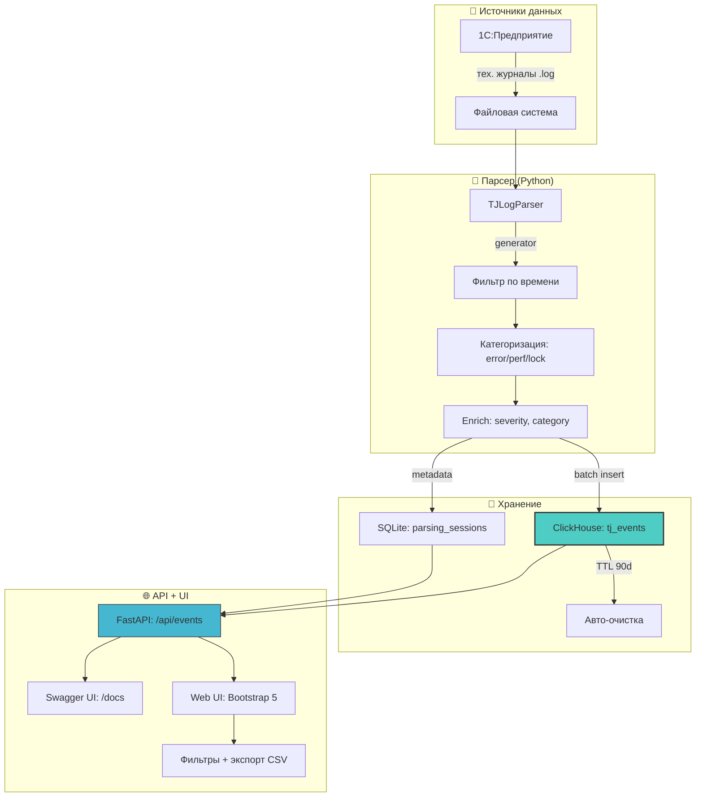

# 🏗️ Архитектура решения

## 🗺️ Компонентная диаграмма

## 🧩 Модульная структура

1c_tj_logs/
├── app/
│   ├── main.py              # FastAPI app factory + lifespan
│   ├── config.py            # Pydantic Settings из .env
│   ├── database.py          # SQLAlchemy + clickhouse-connect
│   ├── models.py            # SQLite ORM: ParsingSession, ParsingFile
│   ├── schemas.py           # Pydantic: Request/Response схемы
│   ├── api/
│   │   ├── routes.py        # APIRouter с префиксом /api
│   │   └── endpoints/
│   │       ├── events.py    # GET /events, POST /export
│   │       ├── parsing.py   # POST /parsing/start, GET /progress/{id}
│   │       └── analysis.py  # GET /analysis/{id} — агрегации
│   ├── parser/
│   │   └── tj_parser.py     # TJLogParser: streaming parsing
│   └── services/
│       └── clickhouse_service.py  # Batch insert, query helpers
├── templates/               # Jinja2: index, events, analysis
├── static/                  # CSS/JS assets
├── data/                    # SQLite: state.db
├── logs/                    # RotatingFileHandler: app.log
└── .env                     # 🔐 Конфигурация (не в git!)

## 🔁 Жизненный цикл сессии парсинга

sequenceDiagram
    participant User as 👤 Пользователь
    participant API as ⚡ FastAPI
    participant DB as 💾 SQLite
    participant Parser as 🔄 TJLogParser
    participant CH as 🗄️ ClickHouse

    User->>API: POST /api/parsing/start {start_date, end_date}
    API->>DB: INSERT parsing_session (status=pending)
    API-->>User: 202 {session_id, status: "started"}
    
    API->>Parser: Запуск в background task
    Parser->>DB: UPDATE status=running, started_at=NOW()
    
    loop Для каждого .log файла
        Parser->>Parser: Чтение с последней позиции
        Parser->>Parser: Парсинг + фильтрация по времени
        Parser->>CH: INSERT batch (50K событий)
        Parser->>DB: UPDATE processed_files, total_events
    end
    
    Parser->>DB: UPDATE status=completed, completed_at=NOW()
    
    User->>API: GET /api/parsing/progress/{session_id}
    API->>DB: SELECT progress metrics
    API-->>User: 200 {progress_percent, current_file, eta}

## 🔄 Интеграция с экосистемой портфолио
graph LR
    A[1c_tj_logs] -->|события 1С| B[ClickHouse]
    B --> C[lakehouse-local: Iceberg]
    B --> D[kafka_clickhouse_pipeline]
    A -->|метрики| E[observability: Prometheus/Grafana]
    A -->|аналитика| F[business-analytics-demo]
    
    style A fill:#FFA07A,stroke:#333
    style B fill:#4ECDC4,stroke:#333
